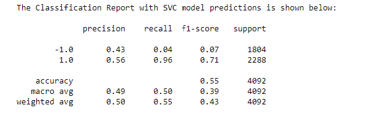
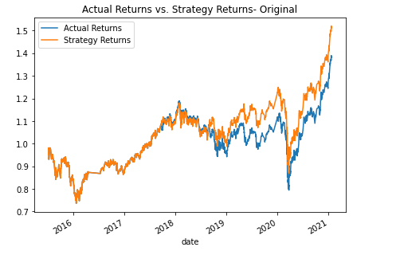
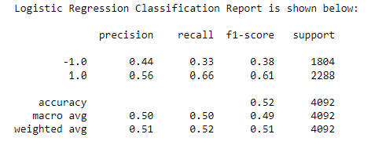
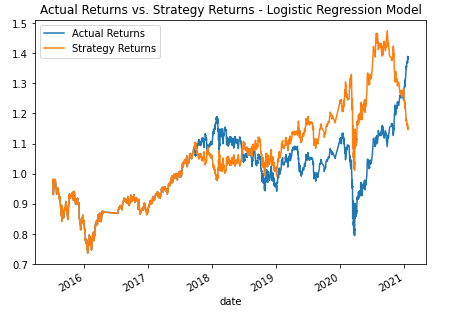

# Module_14_Challenge

## Project Overview

Package Requirements and Versions pip install x ; where 'x' is the package listed below:

`python == 3.7.13+`

`numpy == 1.21.5`

`pandas == 1.3.5+`

`hvplot == 0.7.3`

`matplotlib == 3.5.1`

`json == 2.0.9`

`scikit-learn == 2.0.9`

### Goal

The goal of this project was to assume the role of a finacial advisor at a top five financial advisory firm, who is looking to improve the existing algorithmic trading systems used by the firm, and maintain the it’s competitive advantage in the market.

This will be accomplished by tuning an algorithmic trading bot that learns and adapts to new data and evolving markets. The fundamental steps are to:   
- Implement an algorithmic trading strategy that uses machine learning to automate the trade decisions.

- Adjust the input parameters to optimize the trading algorithm.

- Train a new machine learning model and compare its performance to that of a baseline model.

## Results
 

### SVC Model
 

The performance of the original model has an accuracy of 55%. This model uses a SVC classifier and creates signals by using SMA value and a SMA short window of four days. There is also a long window of 100 days. The training data is based on the first three months of the original dataset. 

We were able to observe changes in the algorithm by increasing and decreasing the training window. Increasing the window led to an increase in Strategy Returns and an improve ment for the recall version 1.0

### Logistic Regression Model
 

The performance of the Logistic Regression Model has so far proved to be less accurate than the original SVC model with an accuracy of 52%. We did however observe an increase in the -1.0 precision, which is positive change, even if it's not the most significant.